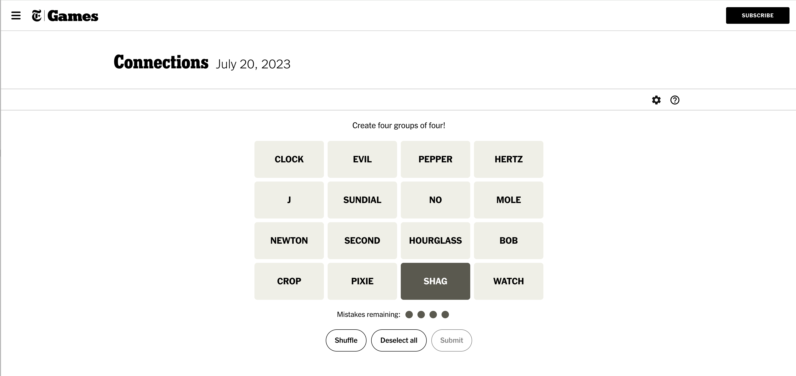
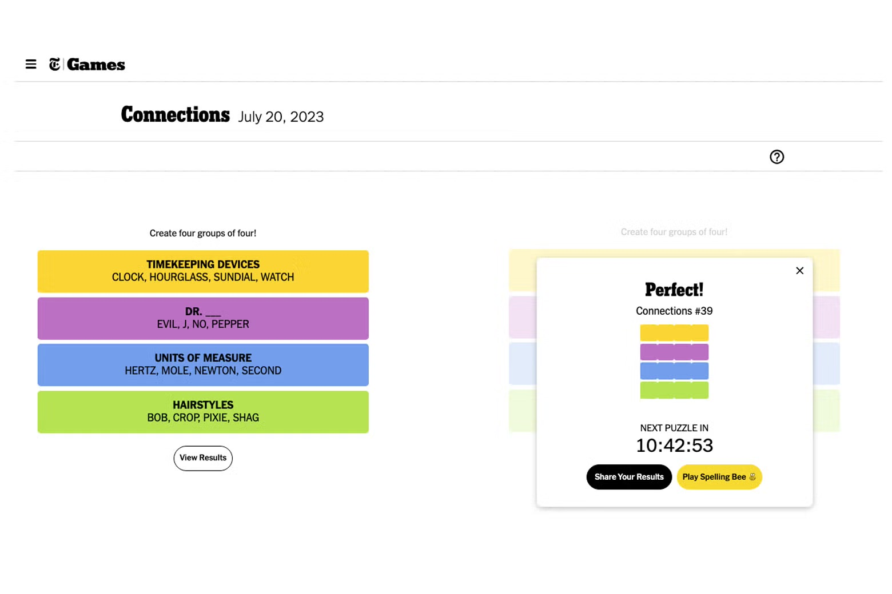

# CSC 335 - Object-Oriented Programming and Design: Connections Game Final Project Specification

## Project Overview
For the final project of our class, we are tasking teams to recreate and enhance popular games or applications. In this project, we will focus on recreating [the Connections game](https://www.nytimes.com/games/connections), a popular word association puzzle game by The New York Times, using Java and JavaFX. This project will stretch over five weeks and will require teams of four students to collaborate on designing, developing, and testing a robust application that not only mimics the gameplay of Connections but also introduces new features to enhance player experience.

# Game Dynamics of Connections

Connections is a word association puzzle game where players aim to connect words through shared associations. The challenge lies in grouping words into categories based on common characteristics or relationships.

## Gameplay Images

Here are two images depicting the basic layout and dynamics of the game:

  
*Example of the Connections game interface showing the initial ungrouped words.*

  
*Example showcasing the endgame state.*

## How to Play

The game presents players with a grid of words. The objective is to sort these words into groups based on a common theme or attribute. For instance, words might be grouped because they are all related to time, they could be names of scientists, or they could represent different types of measurement units.

1. **Grouping Words:** Players select words to form groups.
2. **Hints and Shuffles:** Players can use hints or shuffle the words if they get stuck.
3. **Mistakes:** There is a limited number of mistakes allowed before the game ends.
4. **Submission:** Once all words are grouped correctly, the player can submit their solution.

Players must think critically and make connections between seemingly disparate words to succeed. It's a game that tests both vocabulary and lateral thinking skills.

## Minimum Requirements

### Core Gameplay
- Recreate the basic gameplay of Connections, where players connect words through shared associations.
- Implement an intuitive user interface using JavaFX.

### Game Modes
- **Classic Mode:** Mimic the original gameplay.
- **Time Trial Mode:** Players race against the clock to make as many connections as possible.

### User Profiles
- Allow users to create customizable profiles where their game progress and preferences can be saved.

### Leaderboard
- Implement a leaderboard to display high scores and fastest times across all players.

### Achievements
- Design an achievements page to showcase player milestones and rewards.

### Visual and Usability Enhancements
- Implement a light/dark mode for user preference.
- Include creative animations to enhance the game's visual appeal.

### Testing Suite
- Develop a thorough testing suite for the game model to ensure functionality and reliability (Using JUnit 5).

## Suggested "Wow" Factors

1. **Multiplayer Mode:** Allow players to compete or collaborate in real-time online.
2. **Custom Themes:** Let users create or select themes for the game board and pieces.
3. **Dynamic Difficulty:** Adjust game difficulty based on the player's performance.
4. **Voice Commands:** Integrate voice recognition for a hands-free gaming experience.
5. **Story Mode:** Introduce a narrative element where players progress through levels with a storyline.
6. **Educational Mode:** Implement a mode focused on learning, using connections to teach vocabulary, historical events, etc.
7. **Challenge Mode:** Players face pre-set puzzles with increased difficulty.

## Deliverables

- **Codebase:** Fully commented (using JavaDoc) and readable Java and JavaFX code, committed to a designated GitHub repository. For each major addition or change, utilize feature branches, following best practices in version control and collaborative development.
- **Documentation:** Comprehensive documentation on design choices, game rules, and a user guide. JavaDoc commenting is required for all methods and classes to explain their functionality clearly.
- **Presentation:** A final presentation showcasing your project, highlighting key features, challenges faced, and lessons learned.
- **Testing Suite Results:** A report on the testing suite execution, including test cases, discovered bugs, and how they were addressed.

## Project Management and Collaboration

- **Weekly Sprint Meetings:** Active participation in weekly sprint meetings is mandatory for discussing progress, challenges, and planning.
- **Sprint Documentation on Taiga:** Document each sprint on Taiga, clearly listing completed, ongoing, and future tasks.
- **GitHub Repository:** All project work must be committed to a shared GitHub repository. This repository should utilize feature branches for development, ensuring that the master/main branch remains stable and that work is integrated systematically.

## Evaluation Criteria

- **Functionality:** The game must run smoothly, without bugs, and include all minimum requirements.
- **Design and Usability:** The game interface should be user-friendly, aesthetically pleasing, and intuitive.
- **Creativity:** Incorporation of "wow" factors and original features will be highly regarded.
- **Code Quality:** Code should be well-organized, commented, and follow best OOP practices.
- **Testing and Reliability:** The depth and breadth of testing will be critically evaluated to ensure a robust application.
- **Project Management:** Effective use of GitHub for version control, regular participation in sprint meetings, and thorough sprint documentation on Taiga.

## Timeline

- **Week 1:** Project setup, planning, and division of tasks.
- **Week 2-3:** Core development phase, focusing on minimum requirements.
- **Week 4:** Enhancement phase, where teams add "wow" factors and polish the game.
- **Week 5:** Final testing, documentation, and presentation preparation.

Teams are encouraged to be imaginative and innovative in their approach, making this more than just a programming exercise but a chance to create something unique that could stand out in a portfolio. Good luck!
